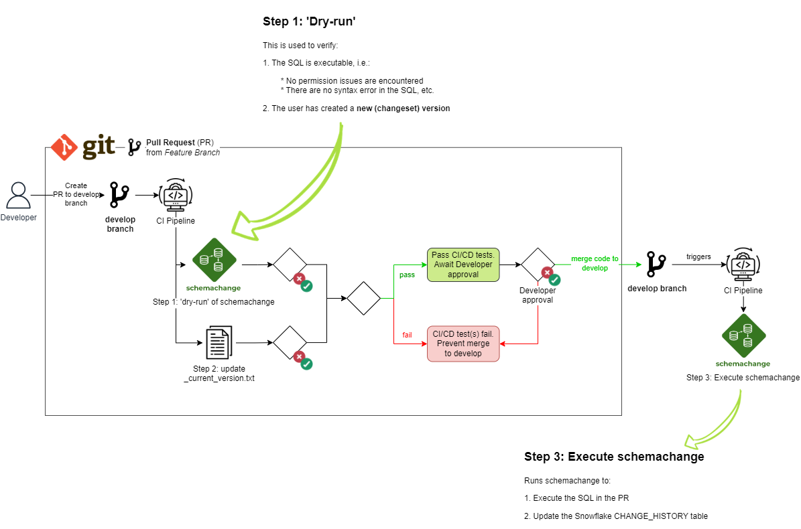

# dmt-scripts-snowflake

This repo contains the DDL scripts used to deploy Snowflake objects within the Data Management team's Snowflake Data Warehouse. Snowflake objects are deployed using Snowflake's [schemachange](https://github.com/Snowflake-Labs/schemachange) tool, in combination with a CI/CD pipeline.

---

## Contents

1. How to Deploy Snowflake Objects
2. Deployment Process Overview
3. Help

---

## 1. How to Deploy Snowflake Objects

1. Create a feature branch
2. Review the latest changeset version, see [schemachange/_current_version.txt](schemachange/_current_version.txt).
3. Create a SQL file with a version number prefix that is **larger** than that listed in [schemachange/_current_version.txt](schemachange/_current_version.txt).
    * E.g., `schemachange/1_users_roles_and_grants/warehouse/V0.0.4__roles.sql`
4. Raise a PR to the `develop` branch.

Only once a PR is approved & merged, will the Snowflake object(s) within the PR be created using schemachange.

## 2. Deployment Process Overview

Shown below is an overview of the end-to-end deployment process:

---

## 3. Help

|   | Question                           | Answer |
| - | --------------------------------- | ----------- |
| 1 | What is schemachange? | See [What is Schemachange \| Confluence](https://payroc.atlassian.net/wiki/spaces/DA/pages/2670624779/What+is+Schemachange) |
| 2 | How has schemachange been set up? | See [How We Have Set Up Schemachange \| Confluence](https://payroc.atlassian.net/wiki/spaces/DA/pages/2658369537/How+We+Have+Set+Up+Schemachange). |
| 3 | What is the difference between *account* and *schema-level* Snowflake objects? | See [Account vs Schema-Level Objects \| Confluence](https://payroc.atlassian.net/wiki/spaces/DA/pages/2672918802/DM+-+Snowflake+-+Account+vs+Schema-Level+Objects). |
| 4 | What Snowflake objects are to be created by schemachange? | See [schemachange/README.md](schemachange/README.md). |
