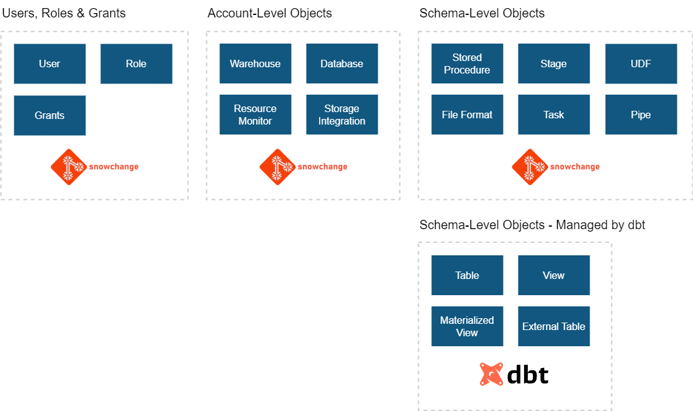

# Database Change Management (DCM), Using Schemachange

For a high-level overview of how to use schemachange with Snowflake in general, see - [A New Approach to Database Change Management with Snowflake \| Medium.com](https://jeremiahhansen.medium.com/a-new-approach-to-database-change-management-with-snowflake-8e3f0fee281).

## Managing Differing Snowflake Object Types

Shown below is an overview of the different Snowflake objects types, and the recommended owner of each object type, as described in the link mentioned above, [A New Approach to Database Change Management with Snowflake \| Medium.com](https://jeremiahhansen.medium.com/a-new-approach-to-database-change-management-with-snowflake-8e3f0fee281):

