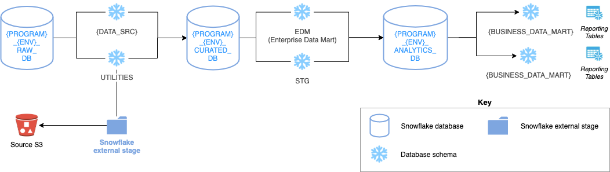

# Snowflake Lightweight Framework

Cookie-cutter framework to quickly create a lightweight Snowflake architecture.

---

## Contents

1. High-level summary
2. Getting started
    * Prerequisites
3. How-to run
    * Input parameters
4. Additional info - overview of execution steps

---

## 1. High-level summary

The framework consists of using a `Makefile` to orchestrate the execution of `SnowSQL` commands.

Where the input args for the `Makefile` come from `env/env_example.json`.

---

## 2. Getting started

### Prerequisites

Before you begin, ensure you have met the following requirements:

| Mandatory / Optional | Prerequisite | Steps |
| -------| -----------| ------------------|
| Mandatory | Specify the DBA username | A custom role hierarchy is created, granting targetted permissions to specific roles. With this in mind, you'll need to specify the name of the DBA user. The significant importance of this DBA user is within the templated SQL script to grant the required permissions to this DBA user: `account_objects/role/permissions/grant_permissions/v1_grant_dba_role.sql` |
| Optional | Create a user for CI/CD activities | If you're looking to carry out CI/CD activities, you'll need to create a corresponding service role. The templated SQL script to create this user can be found within: `account_objects/user/v1_create_pipeline_deploy_user.sql` |

---

## 3. How-to run

The steps involved in building and executing involve:

1) Updating the input parameters within `env/env_example.json` (described below)
2) and running `make`!

---

#### Input parameters (within `env/env_example.json`)

Described below are the input parameters (from the file `env/env_example.json`) that are required for the framework:

| Parameter | Description | Example | Mandatory |
|---|---|---|---|
| `Program` | * Accronym to describe the program of work * Used extensively to prefix DB/account objects * Note: hyphens, spaces or underscores aren't allowed for this value | `DFP`  (accronym for 'Data Foundations Project') | Yes  |
| `Environment` | * The environment type * Used extensively, to prefix DB/account objects | `NP` (Non-Prod), `PROD` | Yes |
| `AwsAccountId` | A 12-digit number that uniquely identifies an AWS account | `123456789012` | Yes |
| `SnowflakeNamedConn` | * Refers to the value of a Snowflake 'named connection' * [`snowsql`](https://docs.snowflake.com/en/user-guide/snowsql.html) stores connection details within a configuration file * The default path to the configuration file is `~/.snowsql/config` * See [Snowflake Named Connections](https://docs.snowflake.com/en/user-guide/snowsql-start.html#using-named-connections) | `eg_sf_profile` | Yes |
| `SnowflakeIAMRoleName` | * Name of the AWS IAM role to be created by the framework * Role to be used to allow comms between S3 bucket(s) and Snowflake | `${PROGRAM}-snowflake-access-role` | Yes |
| `SnowflakeVPCID` | * The ID of the VPC in which Snowflake resides within * Retrieved by running the Snowflake query: `SELECT system$$get_snowflake_platform_info();` * `ACCOUNTADMIN` privileges are required to run this query | `vpc-123f12e1` | Yes |
| `S3BucketEg` | * The name of the S3 bucket to load data into Snowflake from | `s3://eg-s3-bucket` | Yes |

---

## 4. Additional info - overview of execution steps

Described below are the main execution steps / flow of the framework:

1) Creates account objects needed to support the above architecture, including:
    * Databases for each of the zones highlighted above (raw, curated, analytics)
    * A custom role hierarchy (shown below), to exercise RBAC across all of the account/database objects created
    * Corresponding warehouses, resource monitors and 'custom admin-roles', to own account-level operations, e.g. to create a Snowflake Task, Storage Integration object etc.
2) Create database objects needed to support the above architecture (more to follow.)
